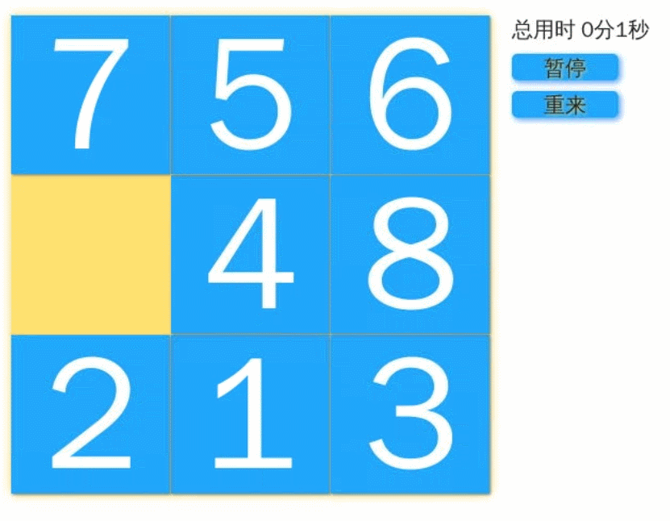
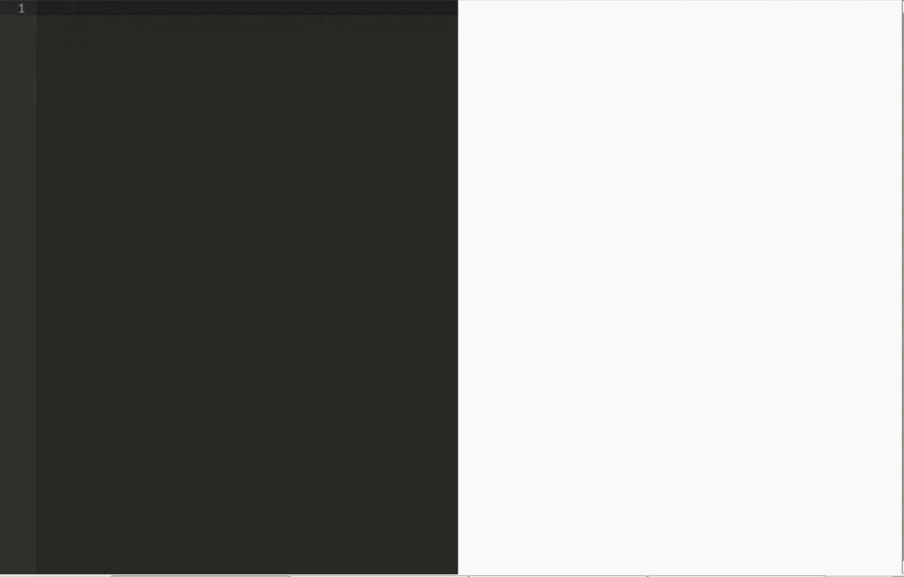
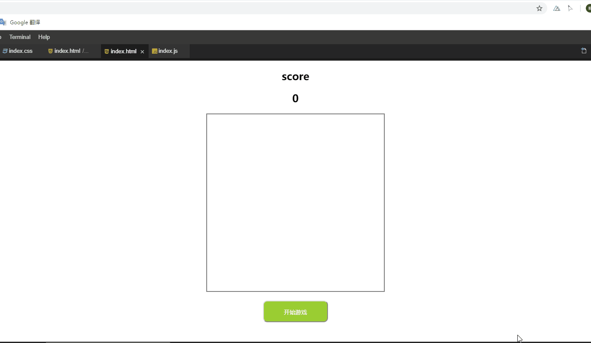

# HTML&CSS&JS 基础项目练习

## 案例01 纯 CSS 打造网页版大白

还记得《超能陆战队》里的 “暖男” -「大白」 么？是不是很想拥有一个？

没问题！在这个案例中我们就利用 HMTL 和 CSS 来打造自己的「大白」！

最终的效果如下图所示：

    

## 案例02 HTML5 实现 2048 游戏

《2048》是一款风靡一时的，非常简单易上手的小游戏，如果你还没玩过，可以在手机上下载一个体验一下。

本案例将使用 `HTML+CSS+JS+jQuery` 实现一个网页版的《2048》。

最终的效果如下图所示：

    

## 案例03 HTML 实现拼图游戏

九宫格拼图相信大家都玩过了，看似简单的小游戏，但实现起来其实并不那么简单。在以前，写程序是程序员的专利，只有他们才能做出一个软件来。但是现在不同了。科技的进步和经济的发展，使得每个人都可以使用计算机。特别是 HTML5 和 CSS3 的流行，使得制作一个基本的游戏变得简单。

在本案例中，我们将基于 HTML + CSS + JavaScript 实现网页版的九宫格拼图游戏。它的玩法是移动空格旁边的方块，使得它们按照方块上面标的数字顺序排序好。

最终的效果如下图所示：

    

## 案例04 HTML 实现 Markdown 编辑器

作为一个程序员，你应该知道 Markdown 吧，它是一种轻量级的标记语言，旨在让人们以简单的方式编写格式化文档。

在本案例中，我们将运用库（`marked`、`ace` 和 `highlight.js`）实现一个实时 Markdown 编辑器，并实现代码高亮效果。

最终的效果如下图所示：

    

## 案例05 网页版别踩白块游戏

别踩白块这个游戏相信很多人都在手机上玩过，今天我们就来做一个网页版的，先上一张游戏效果图：

    

属于简化版别踩白块，代码相对较为简单易学，主要涉及通过 javascript 操作元素节点的增删以及属性节点（class）的操作。

## 案例06 HTML5 Canvas 实现放大镜效果

本项目是由`HTML5`的`canvas`实现的放大镜效果。主要是依靠`canvas`中的`drawImage()`函数，虽然不能完全的给大家展示`canvas`的强大，但希望能通过实现这个简单的项目来让大家初步认识`canvas`，学会基本的`canvas`操作。效果图：

    

这个效果相信各位也不陌生，当我们购物时，鼠标滑过商品展示图时，会看到展示图旁立即出现了一个商品局部放大的展示图，没错，这就是经常出现但容易被我们忽略的放大镜效果。当然，网上也有各种版本的放大镜效果插件，例如，可用 jQuery 实现这效果。

但当我们仔细查看插件源码时，也会发现其中的小秘密。原来 jQuery 插件并没有真正实现图片的放大，而是准备了一大一小且内容相同的两张图，并设置大图的`position`为`absolute`，控制`left`、`right`属性，超出`div`的部分则隐藏，以此来模拟放大效果。其缺点是显而易见，无意义的增加了请求次数，浪费流量；这也并没有真正的实现图片的局部放大效果。