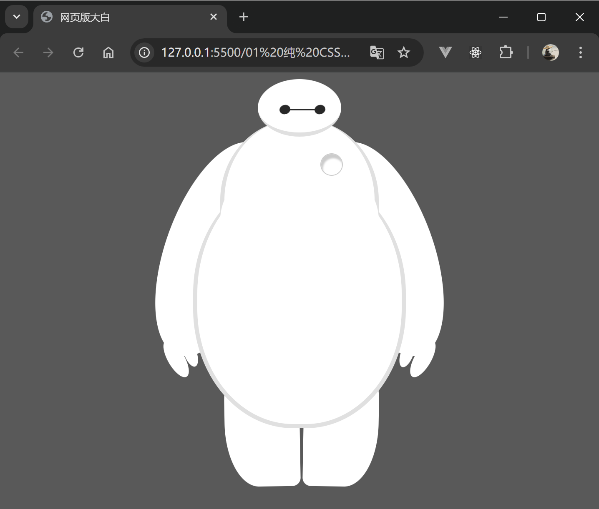
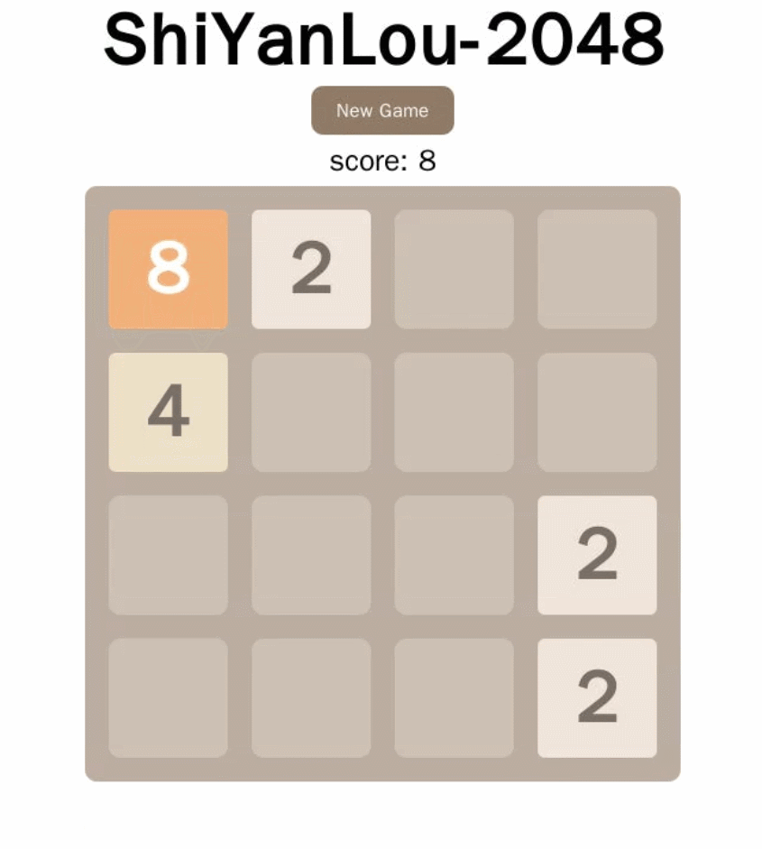

# HTML&CSS&JS 基础项目练习

## 案例01 纯 CSS 打造网页版大白

还记得《超能陆战队》里的 “暖男” -「大白」 么？是不是很想拥有一个？

没问题！在这个案例中我们就利用 HMTL 和 CSS 来打造自己的「大白」！

最终的效果如下图所示：

    

## 案例02 HTML5 实现 2048 游戏

《2048》是一款风靡一时的，非常简单易上手的小游戏，如果你还没玩过，可以在手机上下载一个体验一下。

本案例将使用 `HTML+CSS+JS+jQuery` 实现一个网页版的《2048》。

最终的效果如下图所示：

    

